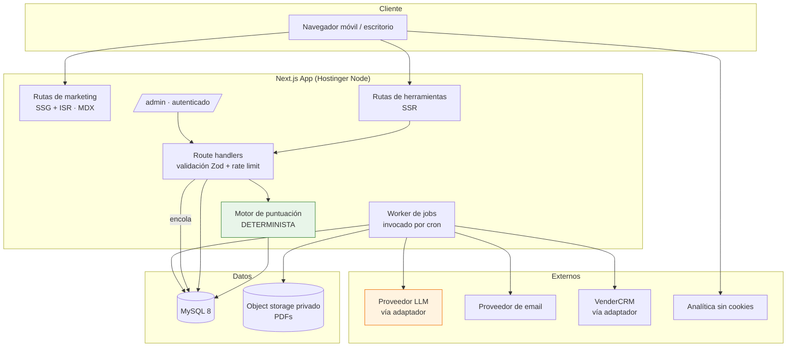
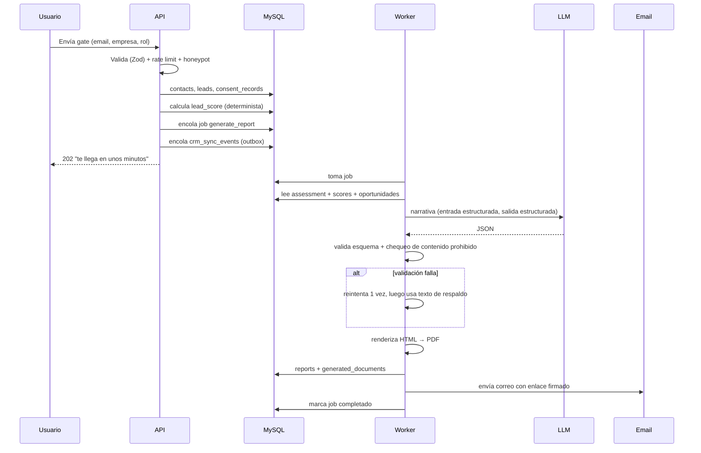
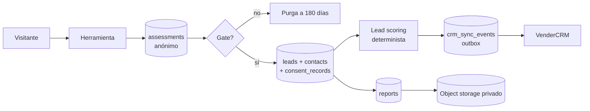

# 11 — Stack and Architecture

---

## 1. Stack comparison

Evaluated against: MVP capability fit, operating complexity for a **two-person team**,
cost, hiring/maintenance reality, and 18–24 month headroom.

| Option | Capability fit | Ops complexity | Cost/mo | Verdict |
|---|---|---|---|---|
| **A. Static site + forms only** | ✗ Cannot do server-side scoring, PDF, jobs, admin rules | Very low | ~$0 | **Rejected** — fails the MVP outright |
| **B. Static marketing + separate API service** | ✓ | **High** — two deploys, two repos, CORS, duplicated auth, split observability | ~$25 | **Rejected** — doubles ops surface for zero benefit at this traffic |
| **C. Laravel/PHP + MySQL + Blade** | ✓ Genuinely capable: queues, jobs, admin, PDF, migrations all first-class | Low-medium | ~$10–20 | **Strong runner-up.** Rejected on ecosystem fit for AI tooling and on team familiarity, not on merit. |
| **D. Next.js + headless CMS + Postgres** | ✓ | Medium-high — a second vendor, content sync, preview builds, webhook rebuilds | ~$40–70 | **Rejected** — solves an editing problem we do not have at ~30 pages |
| **E. Next.js (App Router) monolith + MySQL + MDX content** | ✓ | **Low-medium** — one repo, one deploy, one database | ~$15–30 | **CHOSEN** |
| **F. Hybrid: marketing on WordPress + app subdomain** | ✓ | High — two stacks, two security surfaces, split analytics, WP maintenance | ~$25 | **Rejected** |

### Final choice — E

**One Next.js App Router application, one MySQL database, one deployment,
on Hostinger managed Node hosting.**

```
Next.js 15 (App Router, TypeScript)
MySQL 8 + Drizzle ORM + drizzle-kit migrations
MDX content in-repo (Phase 1–3) → DB-backed content model (Phase 4, conditional)
Tailwind CSS + a small local component set (no heavy UI dependency)
Zod for all input validation, at every trust boundary
Deployed on Hostinger managed Node.js hosting, GitHub-integrated deploys
```

**Why this and not the runner-up (C, Laravel):** the decisive factor is that the same
two people write the site, the AI adapters, the scoring engine and the admin. A single
TypeScript codebase with shared types between the scoring engine, the API routes, the
admin UI and the PDF renderer removes an entire class of drift. Laravel would be a
defensible choice for a PHP-first team; it is the wrong one for this team.

**Why Hostinger and MySQL specifically:** the operator already runs production
Node/MySQL workloads there and knows its failure modes (IPv6 routing, SSH `npm` PATH,
remote-MySQL IP allow-listing, env var handling). Operational familiarity beats
theoretical elegance for a business whose scarcest resource is principal hours.
A Neon Postgres + Prisma variant is a documented, equally valid alternative and should
be chosen if the operator's other work has already moved there — but **not mixed**.

---

## 2. Is Node.js justified?

**Yes — but only because of Phase 2, not Phase 1.**

Phase 1 alone (marketing site, WhatsApp CTAs, a contact form) does **not** justify an
application. If the project were to stop at Phase 1, a static site would be the
correct answer, and this document would recommend it.

Phase 2 requires all of the following, none of which a static site can do:

| Requirement | Why it needs a server |
|---|---|
| Multi-step assessment with per-step persistence | State survives refresh, device, and network drop |
| **Deterministic scoring the client cannot see** | Shipping weights to the browser makes the model public and gameable |
| Versioned, admin-editable questions and rules | Rules change without a deploy; historic reports stay reproducible |
| PDF generation | Server-side rendering, private storage, signed URLs |
| Background jobs | Report generation and email must not block a request |
| Lead scoring | Server-side rules, recomputed on events |
| CRM synchronisation with outbox, retries, manual resend | Durable delivery guarantees |
| Rate limiting and LLM cost caps | Cannot be enforced client-side |
| Audit and consent logging | Evidentiary; must be server-authored |

That set is an application. Given that Phase 2 is the whole point of the product
layer, building Phase 1 on the same stack avoids a rewrite three months in.

---

## 3. Architecture



**The green box never touches the orange box.** Scoring is deterministic and has no
LLM dependency; the LLM is only ever invoked from the worker, after scores exist.

### Report generation sequence



### Data flow



---

## 4. Component decisions

| Concern | Decision | Rationale |
|---|---|---|
| **Rendering** | Marketing SSG + ISR; tools SSR; admin dynamic | Marketing must be fast and cacheable; tools need per-session state |
| **CMS** | MDX in-repo (Phase 1–3). DB model in Phase 4 **only if** a non-technical editor exists | ~30 pages, edited by the developers. A CMS adds a vendor to solve a problem we do not have. Frontmatter matches the future `content_pages` shape so the migration is mechanical. |
| **Database** | MySQL 8 on Hostinger, Drizzle ORM, migrations in-repo | Operational familiarity; Drizzle's typed schema is shared with the scoring engine |
| **Auth** | None for public tools. Email+password + Argon2id + TOTP for `/admin`. End-user accounts deferred to Phase 4. | Every auth surface is a security and support liability. The tokenised result URL covers all MVP access needs. |
| **Session** | Opaque random id in an httpOnly, SameSite=Lax first-party cookie | Enables assessment resume without identifying anyone |
| **Jobs** | `jobs` table drained by an authenticated route invoked by cron every minute, with row-level locking | **No Redis, no queue service.** At <100 jobs/day this is correct, and it removes an entire piece of infrastructure. Revisit at >1,000 jobs/day. |
| **PDF** | Headless Chromium rendering an internal HTML route, in the worker | Same components as the web view; charts as inline SVG so there are no external requests |
| **Email** | One provider behind an `EmailSender` interface; verified domain with SPF/DKIM/DMARC | Provider swap must never touch calling code |
| **AI** | Provider-agnostic adapter, structured outputs, narrative-only. Full contract in `12`. | Model and provider are configuration, not architecture |
| **Analytics** | Cookieless, privacy-respecting analytics (self-hosted or Plausible-class) + our own `lead_events` | We own the funnel data. No ad pixels in Phase 1–2. No cookie wall needed. |
| **Rate limiting** | Sliding window in MySQL keyed by IP + route; stricter caps on LLM-invoking and write routes | No Redis. Adequate at this volume; the table is trivially replaceable later. |
| **Caching** | ISR for marketing; HTTP cache headers on static assets; in-process memo for the published assessment version | Deliberately minimal — premature caching hides bugs at this scale |
| **Search** | None. Category and tag browsing only. | Site-wide search at 60 pages is a solution looking for a problem |
| **Booking** | External scheduler (Cal.com-class) linked, not embedded | Zero build cost; revisit only if the handoff measurably leaks |
| **i18n** | None. Spanish only. | Guaraní or English would be a Phase 5+ decision with its own SEO consequences |

---

## 5. Hosting, security, backups

**Hosting:** Hostinger managed Node.js, GitHub-integrated deploys from `main`.
Staging on a subdomain with `noindex` and **seed data only — never a production dump**.
Environment variables set in the Hostinger panel, never committed. Node version pinned.

**Security:**
- TLS everywhere; HSTS
- CSP restricting script sources; no third-party script may read form fields (`03` N12)
- Zod validation at every trust boundary; parameterised queries only (Drizzle)
- CSRF tokens on all state-changing requests
- Argon2id; TOTP MFA for `owner`/`admin`
- Rate limits on every public write and every LLM-invoking route
- Honeypot + submission-timing check on forms; no CAPTCHA in MVP
- PDFs in private storage, served only via short-lived signed URLs
- Result tokens are 256-bit random, unguessable, `noindex`
- Secrets rotated on staff change; dependency audit in CI; Dependabot enabled
- `audit_logs` append-only (no UPDATE/DELETE grant for the app user)
- **No production data in any non-production environment**

**Backups:**
- Automated daily MySQL dump, 30-day retention, stored off the application host
- Weekly full backup retained 90 days
- Object storage versioning enabled for generated documents
- **Restore tested quarterly against staging.** An untested backup is not a backup; the quarterly test is a calendar obligation, not an aspiration.
- Documented recovery procedure: RPO 24h, RTO 4h

---

## 6. Estimated operating complexity and cost

| Item | Monthly [SUPUESTO] |
|---|---|
| Hosting (Hostinger Node + MySQL) | USD 10–20 |
| Object storage | USD 1–5 |
| Email provider | USD 0–20 |
| Analytics | USD 0–10 |
| Domain | ~USD 3 |
| LLM API | USD 5–40 (report volume dependent, hard-capped) |
| Scheduler | USD 0–12 |
| **Total** | **USD 20–110** |

**Ops burden:** ~2–4 hours/month steady state — dependency updates, backup restore
test (quarterly), cost review, log review. This is the number that justifies the whole
architecture: a two-vendor, two-deploy, CMS-backed alternative would roughly triple it
while delivering the same product.

---

## 7. What would change these decisions

Documented triggers, so the architecture can evolve on evidence rather than on
enthusiasm:

| Trigger | Change |
|---|---|
| A non-technical content editor joins | Build the Phase 4 content module over `content_pages` |
| > 1,000 background jobs/day | Move to a real queue (Redis/SQS); the `jobs` interface stays |
| > 50k monthly sessions | Add a CDN in front; consider read replicas |
| End-user accounts ship (Phase 4) | Add auth, sessions, password reset, and a support runbook |
| Paid products ship (Phase 5) | Add a payment provider, invoicing, tax handling — a significant scope increase, ADR required |
| LLM cost exceeds USD 100/month | Cheaper model for narrative, aggressive caching, or drop to fully templated narrative |
| A second developer joins | Formalise CI checks, PR review, and environment separation |
