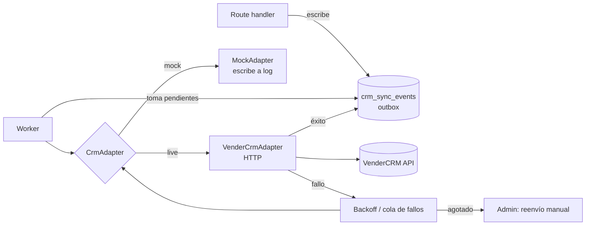

# 13 — VenderCRM Integration

> **No VenderCRM API details are assumed or invented in this document.** Endpoints,
> authentication scheme, field names and response shapes are **placeholders** to be
> filled from the real API documentation before the live adapter is implemented.
> Everything specified here is *our* side of the boundary, which we control and which
> does not change when the real contract is known.

---

## 1. Design principle

The application never knows what a CRM is. It writes a **domain event to an outbox
table**; a worker translates and delivers it through an adapter. This gives us:
durability across CRM outages, retries without duplicates, a full audit trail, manual
resend, and a mock adapter that lets the entire funnel be built and tested before any
credential exists.



**Rule:** no request handler ever calls the CRM. A CRM outage must never affect a
visitor filling in a form.

---

## 2. Adapter interface (ours, stable)

```
interface CrmAdapter {
  name: 'mock' | 'vendercrm'
  syncLead(payload: LeadPayload, idempotencyKey: string): Promise<CrmResult>
  syncContact(payload: ContactPayload, idempotencyKey: string): Promise<CrmResult>
  syncOrganization(payload: OrgPayload, idempotencyKey: string): Promise<CrmResult>
  testConnection(): Promise<{ ok: boolean; detail: string }>
}

type CrmResult =
  | { status: 'ok';        remoteId: string; raw: unknown }
  | { status: 'retryable'; error: string; httpStatus?: number; retryAfterMs?: number }
  | { status: 'permanent'; error: string; httpStatus?: number }
```

**Retryable vs permanent is the adapter's decision**, not the worker's. Network
errors, timeouts, 429 and 5xx are retryable; 400, 401, 403, 422 are permanent and go
straight to the failure queue for human attention. Retrying a 422 forever is how
outboxes turn into noise.

---

## 3. Lead payload (our canonical shape)

Versioned as `payload_version`. Mapping to VenderCRM field names happens in the
adapter, driven by configuration (§8) — never hardcoded in the domain layer.

```json
{
  "payload_version": "1.0.0",
  "idempotency_key": "lead:01J8X…:v1",
  "occurred_at": "2026-08-03T14:22:10Z",

  "organization": {
    "external_id": "01J8X…",
    "nombre": "Inmobiliaria Ejemplo S.A.",
    "industria": "inmobiliaria",
    "industria_label": "Inmobiliaria / desarrolladora",
    "tamano_band": "25-49",
    "ciudad": "Asunción",
    "pais": "PY",
    "sitio_web": null
  },

  "contact": {
    "external_id": "01J8Y…",
    "nombre": "María González",
    "email": "maria@ejemplo.com.py",
    "telefono_whatsapp": "+595981234567",
    "rol": "director_gerente_general",
    "idioma": "es-PY"
  },

  "lead": {
    "external_id": "01J8Z…",
    "admin_url": "https://inteligenciaartificial.com.py/admin/leads/01J8Z…",
    "score": 78,
    "band": "A",
    "stage": "nuevo",
    "origen_herramienta": "diagnostico",
    "proceso_declarado": "Seguimiento de consultas de WhatsApp",
    "valor_estimado_usd": null,
    "review_flag": null,
    "disqualified_reason": null
  },

  "attribution": {
    "source": "organic",
    "medium": "search",
    "campaign": null,
    "landing_page": "/soluciones/inmobiliarias",
    "referrer_url": "https://www.google.com/",
    "first_touch_at": "2026-07-29T11:03:00Z",
    "last_touch_at": "2026-08-03T14:20:55Z"
  },

  "tool_result": {
    "tool": "diagnostico_madurez_ia",
    "assessment_version": "1.0.0",
    "scoring_rule_version": "1.0.0",
    "score_total": 61,
    "banda": 3,
    "banda_label": "Preparación",
    "dimensiones": { "D1": 72, "D2": 58, "D3": 65, "D4": 40, "D5": 60 },
    "oportunidades": [
      { "codigo": "OPP-CS-01", "titulo": "Triage y calificación de consultas entrantes", "esfuerzo": "medio", "impacto": "alto" },
      { "codigo": "OPP-DOC-02", "titulo": "Generación asistida de documentos", "esfuerzo": "bajo", "impacto": "medio" },
      { "codigo": "OPP-KB-03", "titulo": "Asistente interno de conocimiento", "esfuerzo": "medio", "impacto": "medio" }
    ],
    "presupuesto_band": "definido",
    "plazo": "0-3_meses",
    "dueno_interno": "si_con_tiempo",
    "volumen_mensajes": "100-500",
    "report_url": null
  },

  "consent": {
    "marketing_email": true,
    "data_processing": true,
    "whatsapp_contact": true,
    "texto_version": "politica-v1.0",
    "granted_at": "2026-08-03T14:22:08Z",
    "source_page": "/herramientas/diagnostico-de-ia"
  },

  "score_breakdown": {
    "tamano": 20, "industria": 20, "rol": 14, "presupuesto": 20,
    "plazo": 12, "dueno_interno": 8, "volumen": 5, "ubicacion": 5, "comportamiento": 8
  }
}
```

**`report_url` is null by default.** The PDF is served only through short-lived signed
URLs; a permanent link in an external system would be an uncontrolled data export.
Send it only if VenderCRM's access model justifies it — an explicit decision, not a
default.

**Sensitive-data posture:** the payload carries qualification data and business
context, never raw salary figures, never assessment free text beyond the 120-char
`proceso_declarado`, never document contents.

---

## 4. Source attribution
Both first-touch and last-touch are sent (`attribution`). The `landing_page` and
`origen_herramienta` fields are what make cluster-level ROI measurable (`06` §11).
Because referrals are systematically under-counted by digital attribution in this
market (`07` §13), the CRM record is also **manually tagged with the true origin** by
sales after the first conversation — the payload provides the digital signal, the
human provides the truth.

---

## 5. Idempotency

`idempotency_key = "{entity_type}:{public_id}:v{payload_revision}"`

- `UNIQUE` on `crm_sync_events.idempotency_key` — a duplicate enqueue is a no-op at the database level
- The key is sent to the CRM in whatever mechanism it supports (header or body field — **placeholder** until documented)
- If the CRM has no idempotency support, the adapter performs a lookup-by-`external_id` before creating, and the resulting `crm_remote_id` is stored so subsequent syncs become updates
- A lead updated later (stage change, score change) enqueues a **new event with an incremented `payload_revision`**, never a mutation of the existing row

---

## 6. Retries and failure queue

| Attempt | Delay |
|---|---|
| 1 | immediate |
| 2 | 1 min |
| 3 | 5 min |
| 4 | 30 min |
| 5 | 2 h |
| 6 | 6 h |

Exponential with jitter, `max_intentos = 6`. After exhaustion:
`status = 'fallido'`, surfaced in the admin outbox by default, and — for a **band A or
B lead** — an immediate alert email to the owner. A hot lead stuck in an outbox is a
lost deal, so it is treated as an operational incident, not a log line.

`status = 'descartado'` requires a human action and a reason, and is audit-logged.

**Failure never blocks the business:** the lead is fully usable in our own admin
regardless of CRM state. The CRM is a destination, not the system of record, for the
whole of Phase 1–3.

---

## 7. Manual resend
Admin outbox (`09` §9): retry now · retry all failed · edit payload and retry
(audit-logged, with a before/after diff) · discard with reason · view full request and
response. `testConnection()` is exposed as a button. The adapter mode (`mock`/`live`)
is displayed prominently on the screen so a mock environment can never be mistaken for
production.

---

## 8. Mapping configuration

```json
{
  "mapping_version": "1.0.0",
  "endpoints": {
    "base_url": "PLACEHOLDER",
    "create_lead": "PLACEHOLDER",
    "update_lead": "PLACEHOLDER",
    "create_contact": "PLACEHOLDER",
    "create_organization": "PLACEHOLDER"
  },
  "auth": {
    "type": "PLACEHOLDER (bearer | api_key_header | oauth2)",
    "credential_env_var": "VENDERCRM_API_KEY"
  },
  "field_map": {
    "organization.nombre":        "PLACEHOLDER_company_name",
    "contact.email":              "PLACEHOLDER_email",
    "contact.telefono_whatsapp":  "PLACEHOLDER_phone",
    "lead.score":                 "PLACEHOLDER_custom_score",
    "lead.band":                  "PLACEHOLDER_custom_band",
    "tool_result.score_total":    "PLACEHOLDER_custom_maturity",
    "attribution.source":         "PLACEHOLDER_source"
  },
  "value_map": {
    "industria": { "inmobiliaria": "PLACEHOLDER", "estudio_contable": "PLACEHOLDER" },
    "band":      { "A": "PLACEHOLDER", "B": "PLACEHOLDER" }
  },
  "unmapped_fields_strategy": "send_as_note"
}
```

Editable in admin, versioned, audit-logged. `unmapped_fields_strategy` matters: rather
than dropping data we cannot map, the adapter composes a **human-readable Spanish
summary note** containing the full tool result. Even against a CRM with no custom
fields, a salesperson opening the record sees the maturity score, the three
opportunities and the declared process. This is what makes the integration useful on
day one regardless of VenderCRM's schema.

---

## 9. Webhooks (inbound) — placeholder

If VenderCRM can call us on stage changes, `POST /api/webhooks/vendercrm`:
signature verification (**placeholder** — scheme unknown), replay protection via a
timestamp window and an event-id cache, mapping of remote stage → our `leads.stage`,
and full logging. **Not built in MVP.** Until then the CRM is write-only from our
side, and our admin remains the system of record for lead state.

---

## 10. Build sequence

| Step | Phase | Deliverable |
|---|---|---|
| 1 | 1 | `crm_sync_events` table, outbox writes on every lead creation |
| 2 | 1 | `MockAdapter` — writes payloads to a log and the admin viewer. **The entire funnel is testable here, with no credentials.** |
| 3 | 1 | Worker: claim, deliver, retry, backoff, failure states |
| 4 | 1 | Admin outbox UI with manual resend |
| 5 | 2 | Payload v1.0.0 finalised with the full tool result |
| 6 | 3 | **Read the real VenderCRM API docs.** Fill placeholders. Build `VenderCrmAdapter`. |
| 7 | 3 | Field mapping configured against the real schema; connection test; staging run |
| 8 | 3 | Live cutover; backfill historical leads via manual resend |
| 9 | 4 | Inbound webhooks, if supported |

Steps 1–5 are complete before anyone reads a line of VenderCRM documentation. That is
the point of the adapter: the CRM's contract is the last thing we need to know, not the
first.

---

## 11. Testing

- Unit: payload builder against fixture leads — snapshot-tested
- Unit: mapping configuration applied to a fixture payload
- Integration: outbox → worker → mock adapter → success, with an `ok` status recorded
- Integration: forced 500 → retries with correct backoff → eventual `fallido`
- Integration: forced 422 → immediate `fallido`, **no retries**
- Integration: duplicate enqueue → single row, single delivery
- Integration: manual resend from admin succeeds and is audit-logged
- **Contract test against a recorded/stubbed VenderCRM response**, added at step 6 and run in CI thereafter
- **No test ever calls the live CRM.**
