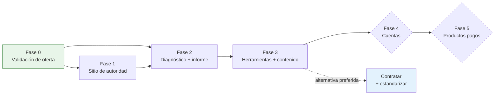

# 14 — Implementation Phases

**Sequencing principle:** revenue before software. Phase 0 must produce paying clients
before Phase 2 produces an assessment engine. A business that builds the tool first
learns whether the tool works; a business that sells first learns whether the *offer*
works — which is the more expensive thing to be wrong about.

Timelines are **effort estimates for a two-person team [SUPUESTO]**, not commitments.

---

## Phase 0 — Offer and market validation
**Duration:** 6–8 weeks · **No application code.**

**Scope**
- 20 direct conversations with the ICP across the three verticals (referral-led, not cold)
- Deliver one free workshop to a gremio or chamber in exchange for the attendee list
- Write and test the audit methodology, interview guide, measurement sheet, report skeleton
- Build the sample audit report on **clearly labelled fictional data**
- Write the proposal template, contract, exclusions list, change-order clause
- **Sell and deliver 3 paid audits at full price**
- Deliver 1 Sprint from one of those audits
- Register the domain, set up email, Google Business Profile, LinkedIn

**Exclusions:** any website beyond a one-page holding page with contact details; any
tool; any CMS; any design system.

**Dependencies:** none.

**KPIs:** 20 conversations · 3 audits sold · 1 Sprint sold · audit delivered in ≤6.5 person-days.

**Exit criteria (all required):**
1. **G1** — 3 audits sold within 8 weeks
2. **G2** — first audit delivered within the day budget
3. **G3** — ≥1 audit converts to a Sprint
4. The three verticals are confirmed, or replaced with what the conversations actually revealed
5. The pricing hypotheses in `10` are confirmed or revised with real data

**If G1 fails:** do not proceed to Phase 1. Revisit ICP, offer, or price. Building a
website on an unvalidated offer is the most expensive mistake available here.

---

## Phase 1 — Authority and lead-generation website
**Duration:** 5–7 weeks

**Scope**
- Next.js application scaffold, MySQL, Drizzle, migrations, CI
- 15 marketing pages (`06` §4 routes 1–15) + 4 launch articles
- Design system: one direction, applied consistently (see `conversion-design` patterns)
- WhatsApp CTA system with per-page context
- Contact form → `leads` → outbox → **mock CRM adapter**
- Deterministic lead scoring for form leads
- Admin: auth, roles, lead list/detail, consent log, audit log, outbox viewer
- Analytics (cookieless) + `lead_events`
- Legal pages incl. `/legal/uso-de-ia`
- Sitemap, robots, structured data, metadata patterns
- Sample audit report published on `/recursos/informe-de-ejemplo`

**Exclusions:** assessment, calculator, prompt library, PDF generation, LLM
integration, user accounts, live CRM, payments, blog CMS.

**Dependencies:** Phase 0 exit. Real content requires real delivered projects to write
credibly about — which is precisely why Phase 0 comes first.

**KPIs:** 15 pages live · Lighthouse mobile ≥85/95/100 · 300 organic sessions/mo by
week 10 · first inbound lead from search · 100% of leads reaching the outbox.

**Exit criteria:** all Phase 1 routes live and indexed · every lead appears in admin
within 5s with a score and consent record · no fabricated proof anywhere (content lint
passes) · at least 1 inbound web lead.

---

## Phase 2 — Readiness assessment and report
**Duration:** 7–9 weeks · **The core product build.**

**Scope**
- Assessment schema, versioning, admin question management, publish workflow with fixture diff
- 24 questions, 6 sections, mobile-first UI with per-step persistence
- **Deterministic scoring engine** + full test suite (≥20 fixtures, boundary cases)
- Opportunity catalogue + deterministic matching rules
- Free on-screen results + tokenised results page
- Email gate → lead creation → scoring → outbox
- `jobs` table + cron-invoked worker
- AI adapter, prompt registry, structured outputs, all validation gates (`12` §4)
- PDF generation, private storage, signed URLs
- Transactional email + nurture sequence R0–R4
- Admin: scoring rules, opportunity catalogue, report templates, report queue, AI cost dashboard
- Eval suite E1–E10 in CI

**Exclusions:** calculator, prompt library, accounts, live CRM, payments, chatbot demos.

**Dependencies:** Phase 1 · the assessment content itself must be authored by someone
who has now delivered real audits (that is where the questions come from).

**KPIs:** assessment completion ≥55% · median duration ≤8 min · gate conversion ≥40% ·
report p95 <3 min · LLM cost/report <USD 0.10 · ≥5 band A/B leads in the first 90 days (**G6**).

**Exit criteria:** all `03` §14 acceptance criteria pass · E1–E10 green · scoring
reproducible across rule versions · a rule change in admin produces a new version
without breaking historic reports · principal has signed off 5 full reports.

---

## Phase 3 — Supporting tools and content expansion
**Duration:** 6–8 weeks

**Scope**
- Calculadora de Costo de Tareas Repetitivas (server-side, assumptions panel, seeded CTA)
- Biblioteca de Prompts (categories, detail pages, copy tracking, editorial workflow)
- Resource library: policy template, data checklist, use-case pages per vertical
- Content: articles T5–T30 at 4/month
- **Live VenderCRM adapter** (`13` steps 6–8) — placeholders filled from real docs
- Full analytics dashboard incl. the capacity panel
- Data deletion request tooling
- Tool registry with configurable constants and caps

**Exclusions:** accounts, payments, chatbot demos, policy generator, new verticals.

**Dependencies:** Phase 2 · real VenderCRM API documentation · enough delivered
projects to write 26 credible articles.

**KPIs:** 2,500 organic sessions/mo · calculator→assessment ≥15% · 3 tools live and
none more · CRM sync success ≥99% · standardised delivery hours ≥60% (**G7**).

**Exit criteria:** three tools live and meeting their quarterly review thresholds ·
live CRM sync running with a working failure queue · 30 content pages published, all
passing the `06` §10 checklist.

---

## Phase 4 — Customer accounts and recurring tools
**Duration:** 8–10 weeks · **Conditional — requires an explicit go decision.**

**Gate before starting:** ≥4 active retainers, and a documented, repeated client
request for a portal. If clients are not asking, do not build it.

**Scope:** `users` table, auth, email verification, password reset · client portal
(deliverables, monthly retainer reports, usage metrics) · saved assessments and
year-over-year comparison · Generador de Política de Uso de IA · chatbot demos under
the strict conditions in `04` §4 · DB-backed content management (only if a
non-technical editor exists) · inbound CRM webhooks.

**Exclusions:** payments, subscriptions, public API, mobile app.

**KPIs:** ≥60% of retainer clients active in the portal monthly · retainer churn <5%/quarter.

**Exit criteria:** portal used by a majority of retainer clients · support load from
accounts <2h/month.

---

## Phase 5 — Paid digital products
**Duration:** 6–8 weeks · **Conditional.**

**Gate:** Phases 1–4 stable, delivery standardisation ≥65%, and evidence of demand
(people asking to buy the templates we already give away).

**Scope:** payment provider + invoicing + tax handling · 2–3 template/playbook
products · the training quiz as a paid workshop add-on · `subscription_plans` **only
if** a recurring product is validated.

**Honest framing:** this phase adds meaningful operational overhead (payments, tax,
refunds, support) for a revenue line that is small in a market this size (`10` §1.6).
Its real justification is the low-friction first transaction, not the revenue. If
Phase 4 KPIs are healthy and delivery capacity is the binding constraint, **skipping
Phase 5 entirely and hiring instead is the better decision.** That is a legitimate
outcome of this plan, not a failure of it.

---

## Dependency map



---

## ADR process

Any deviation from a locked decision (`00` §0.8) requires an ADR in
`docs/adr/NNNN-titulo.md`:

```
# ADR-NNNN — Título
Fecha · Estado (propuesto | aceptado | rechazado | reemplazado)
Decisión bloqueada afectada (00 §0.8, ítem N)
Contexto — qué cambió desde que se tomó la decisión
Opciones consideradas
Decisión
Consecuencias — incluyendo qué se vuelve más difícil
Revisión de Opus — requerida sí/no · fecha · resultado
```

**Requires Opus review:** stack changes · adding a fourth tool · any LLM in a scoring
path · new gating · new personal-data fields · scoring model architecture · pricing
floors · adding a vertical.

**Does not require review:** copy, styling, content, question wording within the
existing model, weight tuning within published bounds, refactors that preserve behaviour.
